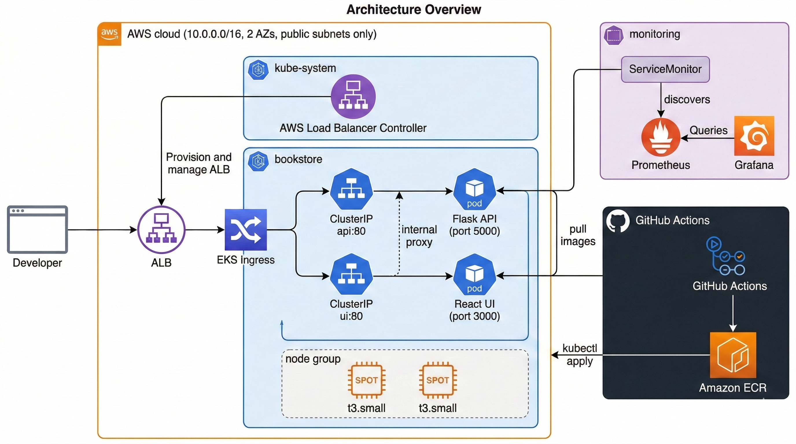
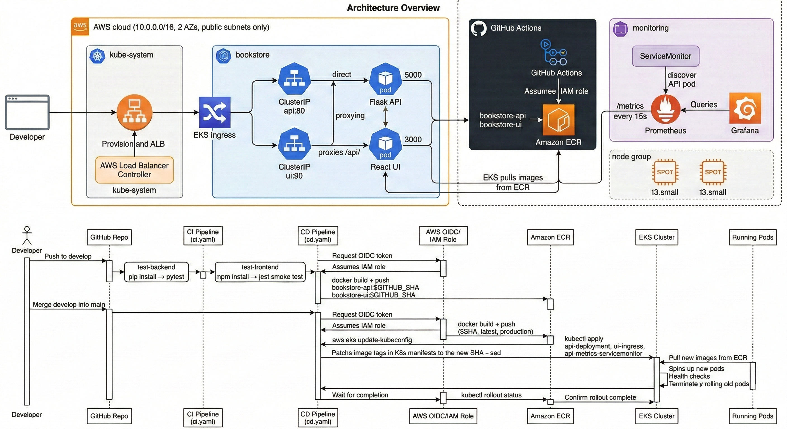

# 📚 EKS Bookstore App

A full-stack bookstore application deployed on **Amazon EKS** with automated CI/CD, infrastructure-as-code, and production-grade monitoring — built to demonstrate real-world DevOps practices on AWS.


---

## What This Project Covers

| # | Topic | What You'll Learn |
|---|-------|-------------------|
| 1 | **Containerization** | Dockerize a Python Flask API and React UI with multi-stage builds |
| 2 | **Infrastructure as Code** | Provision an EKS cluster, VPC, ECR, and IAM roles with Terraform |
| 3 | **Kubernetes** | Deploy pods, services, and ingress; manage namespaces and rollouts |
| 4 | **CI/CD Pipeline** | Automate test → build → push → deploy using GitHub Actions with OIDC (no stored keys) |
| 5 | **Ingress & Load Balancing** | Route external traffic via AWS ALB (EKS) and NGINX Ingress Controller (local) |
| 6 | **Observability** | Instrument Flask with Prometheus metrics; scrape via ServiceMonitor; visualize in Grafana |
| 7 | **Cost Optimization** | Use SPOT instances, public-only subnets (no NAT gateway), and ECR lifecycle policies |
| 8 | **Local Testing** | Reproduce the full stack locally with k3d — no AWS account required |

---

## Architecture

### System Architecture



### CI/CD Workflow



---

## Quick Start

| Goal | Guide |
|------|-------|
| Deploy to AWS EKS | [Docs/setup/02-aws-setup.md](Docs/setup/02-aws-setup.md) |
| Test locally with k3d | [Docs/setup/03-local-testing.md](Docs/setup/03-local-testing.md) |
| Understand the CI/CD pipeline | [Docs/cicd.md](Docs/cicd.md) |

**Prerequisites:** [Docs/setup/01-prerequisites.md](Docs/setup/01-prerequisites.md)

---

## Project Structure

```
├── api/                          # Flask REST API (Python 3.11)
├── ui/                           # React 19 frontend
├── k8s/                          # Kubernetes manifests
│   ├── api-deployment.yaml       # API pod + ClusterIP service
│   ├── ui-deployment.yaml        # UI pod + ClusterIP service
│   ├── ingress.yaml              # ALB ingress (EKS only)
│   ├── ingress-local.yaml        # NGINX ingress (k3d local testing)
│   ├── api-metrics-servicemonitor.yaml  # Prometheus ServiceMonitor
│   └── prometheus-values.yaml    # kube-prometheus-stack Helm values
├── terraform/                    # Infrastructure as Code (VPC, EKS, ECR, IAM)
├── .github/workflows/
│   ├── ci.yaml                   # CI: test → build → push (develop branch)
│   └── cd.yaml                   # CD: build → push → deploy (main branch)
├── bootstrap.sh                  # One-command post-terraform deployment
└── Docs/
    ├── setup/
    │   ├── 01-prerequisites.md   # Tools, AWS permissions
    │   ├── 02-aws-setup.md       # Terraform + deploy steps
    │   ├── 03-local-testing.md   # Full k3d guide
    │   └── 04-teardown.md        # Cleanup instructions
    ├── cicd.md                   # Pipeline deep-dive + branching strategy
    ├── Monitoring.txt            # Prometheus/Grafana reference + PromQL
    └── Roles-Policies.txt        # IAM roles, policies, secrets reference
```

---

## API Endpoints

| Method | Endpoint | Description |
|--------|----------|-------------|
| GET | `/api/health` | Health check |
| GET | `/api/products/featured` | Featured products |
| GET | `/api/products/<id>` | Get product by ID |
| GET | `/api/categories` | List all categories |
| GET | `/api/categories/<id>/products` | Products by category |
| GET | `/api/cart` | View cart |
| POST | `/api/cart/add` | Add item to cart |
| POST | `/api/cart/checkout` | Checkout |

---

## Cost Estimate

Designed to run within a **$120 AWS free credit** budget:

| Decision | Impact |
|----------|--------|
| SPOT instances (t3.small) | ~60–70% cheaper than on-demand |
| No NAT gateway (public subnets only) | Saves ~$32/month |
| 2 Availability Zones | Fewer subnet/resource costs |
| ECR lifecycle (keep 5 images) | Minimal storage cost |
| emptyDir for Prometheus | No EBS volume needed |
| **Estimated total** | ~$30–40/month (~3 months on $120 credits) |

---

## Useful Commands

```bash
# Connect to the EKS cluster
aws eks update-kubeconfig --name <CLUSTER_NAME> --region us-east-1

# Check pods
kubectl get pods -n bookstore
kubectl get pods -n monitoring

# Get ALB URL
kubectl get ingress -n bookstore

# View logs
kubectl logs -n bookstore deployment/api
kubectl logs -n bookstore deployment/ui

# Grafana
kubectl port-forward svc/prometheus-grafana 3001:80 -n monitoring
# → http://localhost:3001  |  admin / bookstore-admin

# Prometheus
kubectl port-forward svc/prometheus-kube-prometheus-prometheus 9090:9090 -n monitoring
# → http://localhost:9090

# Terraform outputs
cd terraform && terraform output
```
